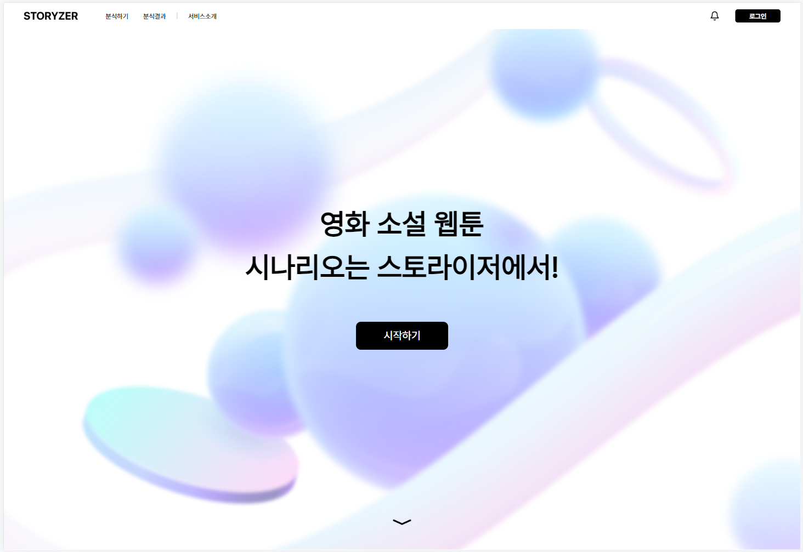

# STORYZER 
## 목적 : 
- 스토라이저(Storyzer)는 '*Story*' + '*Analyze*'의 합성어로써 영화, 드라마, 웹툰 등 여러 분야의 시나리오를 분석하고 AI 기술을 통해 잠재적 인기 요소를 예측하는 서비스입니다. 예측 데이터를 기반으로 사용자가 완성도 있는 시나리오를 제작할 수 있도록 피드백을 제공할 뿐만 아니라 성공 확률을 높이기 위한 프로모션, 시나리오 개선 방향 등 다양한 전략 수립 솔루션을 제공합니다.

## 개발 기간 :
- 2023.08.23 ~ 2023.09.03

## 참여 인원 :
- UI/UX Design : 1명
- Frontend-end : 1명
- Back-end & AI Model : 2명

## 사용 스택 :
- UI/UX Design : Figma
- Frontend-end : HTML, CSS, Next.JS
- Back-end & AI Model : Python
- Etc : Open AI

## 사용 툴 : 
- Github, Swit, Notion, Figma, Adobe Photoshop, Adobe Illistrator, vsCode, 
- Etc : Google Meet

## mvp 
- mvp 주소 : http://storyzer.kr/

---

### - 홈화면 & 서비스 소개 - 랜딩 페이지

### - 로그인

### - 분석하기 - 기본정보 작성, 장르 최대 3가지 선택, 연령대 선택, 런타임 작성, 줄거리 작성

### - 분석 결과 - 줄거리 키워드, 예상 평점, 예상 수익

 

---
